# Persona Studio — Build Plan

**Project:** Production system for a recurring, openly-AI female golf personality
**Positioning:** Standalone media asset (one persona, built for quality and longevity)
**Owner:** Layton · **Plan date:** 22 Sep 2026
**Audience for this document:** Claude Code (build agent) and the engineer supervising it

---

## 0. Read this first

This is the build plan for the software that produces, quality-controls, and publishes the persona's content. It is **not** the creative concept. Name, look, voice, and content calendar are decided by humans and fed into the system as config.

Four facts shape the whole architecture:

1. **Generation is cheap; identity consistency is the hard problem.** The system exists mainly to hold one face steady across hundreds of clips, and to catch drift automatically before a human sees it.
2. **Model names, prices, and APIs will be stale within two quarters.** Nothing model-specific is hardcoded. Every provider sits behind an adapter; every price lives in config.
3. **The persona is openly AI, by design.** Disclosure is enforced in code. A render cannot be exported without the disclosure overlay, and a publication record cannot be created without the AI-label flag.
4. **Identity must be a company-owned asset.** The durable identity layer is a LoRA trained and held in-house, not a vendor's hosted identity feature.

### An important technical constraint on point 4

The flagship video models (Veo, Sora, Kling) are closed and do not accept custom LoRAs. So the identity pipeline is two-stage:

```
In-house LoRA on an open image model  →  consistent keyframe still per shot
                                       →  image-to-video on a hosted video model
```

The LoRA guarantees the face in the first frame; the video model animates it. Drift happens during animation, which is why automated face scoring on the output (Section 6.4) is mandatory, not optional.

---

## 1. Decisions required from humans (not from Claude Code)

Claude Code must **not** make these decisions. Where the build needs a value, use the placeholder and flag it.

| # | Decision | Placeholder in config | Blocks |
|---|---|---|---|
| D1 | Persona name, look, backstory, voice | `persona.yaml` → `PERSONA_NAME`, etc. | Phase 1 master set |
| D2 | Production model: fully synthetic now, hybrid later? (Build supports both) | `production.mode: synthetic` | Phase 3 ingest |
| D3 | Owning entity. Must sit outside all FCA/ASIC-regulated entities | n/a | Phase 4 publishing |
| D4 | Permanent exclusion of financial products (recommended: yes) | `content_policy.financial_products: forbidden` | Phase 3 shot-list guard |
| D5 | Kill criteria: audience/revenue numbers and dates that mean "stop" | `kill_criteria.yaml` | Phase 4 dashboard |
| D6 | Day-to-day operator (named person) | n/a | Phase 3 review UI users |
| D7 | Counsel sign-off on disclosure configuration | n/a | Any public account |
| D8 | Monthly generation budget ceiling | `budget.monthly_usd` | Phase 0 cost guard |

---

## 2. Scope

### In scope

- Persona asset store (master reference set, LoRA versions, voice config)
- LoRA training pipeline for the persona's face/body
- Provider adapters for image, video, voice, and lip-sync models
- Shot-list generation from a content brief (Claude API)
- Generation orchestrator: multiple takes per shot, locked references, cost tracking
- Automated identity-consistency scoring on every take
- Human review UI: accept/reject takes, rate, annotate
- Voice layer and lip sync
- Automated assembly: rough cut, captions, disclosure overlay, platform cuts
- Provenance: C2PA signing and a full generation log
- Analytics ingestion and a kill-criteria dashboard
- Publishing support (manual first; API drafts later, always human-approved)

### Out of scope

- Creative concept, persona design, content calendar (humans)
- Entity setup, contracts, counsel review (humans)
- Fully automated posting without human approval (never)
- Any content involving financial products (see D4)

---

## 3. Architecture

```mermaid
flowchart LR
    subgraph Identity
        MS[Master reference set] --> LT[LoRA training]
        LT --> LV[(LoRA versions)]
    end

    CB[Content brief] --> SL[Shot-list generator<br/>Claude API]
    SL --> KF[Keyframe generator<br/>image model + LoRA]
    LV --> KF
    KF --> VG[Video generator<br/>image-to-video, N takes]
    VG --> IS[Identity scorer<br/>face embeddings]
    IS -->|below threshold| VG
    IS -->|passes| RQ[Human review queue]
    RQ -->|reject| VG
    RQ -->|accept| VL[Voice + lip sync]
    VL --> AS[Assembler<br/>ffmpeg]
    AS --> DO[Disclosure overlay<br/>+ captions]
    DO --> C2[C2PA signing]
    C2 --> PC[Platform cuts<br/>9:16 / 16:9 / 1:1]
    PC --> PB[Publish<br/>human-approved]
    PB --> AN[Analytics ingestion]
    AN --> KD[Kill-criteria dashboard]
```



### Recommended stack

| Layer | Choice | Notes |
|---|---|---|
| Language | Python 3.12 | Type hints throughout, `ruff` + `mypy` |
| API/UI | FastAPI + Jinja2 + HTMX | Server-rendered review UI; no SPA needed |
| Database | Postgres | SQLAlchemy 2.x + Alembic migrations |
| Jobs | Redis + `arq` | Generation calls are slow and async |
| Object storage | S3-compatible bucket | All media; DB stores keys, not blobs |
| Media | ffmpeg | Assembly, transcode, overlays, cuts |
| Face scoring | Face-embedding model (ArcFace-class) | **Check licence for commercial use** — some popular pretrained weights are non-commercial only |
| Provenance | `c2pa-python` / `c2patool` | Requires a signing certificate |
| LLM | Claude API | Shot lists, prompt drafting, captions |
| Hosting | Railway (or equivalent) | Web, worker, Postgres, Redis, bucket |
| GPU (LoRA training) | Hosted GPU provider | Training is occasional; don't run a GPU permanently |

Deviate from the stack only with a written reason in `docs/decisions/`.

### Repository layout

```
persona-studio/
├── CLAUDE.md
├── BUILD_PLAN.md
├── config/
│   ├── persona.yaml            # D1 placeholders
│   ├── providers.yaml          # models, endpoints, prices
│   ├── prompts/                # locked prompt fragments
│   ├── content_policy.yaml     # D4, format rules
│   ├── budget.yaml             # D8
│   └── kill_criteria.yaml      # D5
├── app/
│   ├── api/                    # FastAPI routes
│   ├── ui/                     # templates for review UI
│   ├── models/                 # SQLAlchemy models
│   ├── providers/              # adapters: image, video, voice, lipsync, llm
│   ├── pipeline/               # shotlist, keyframes, generate, score, assemble
│   ├── identity/               # master set, LoRA training, embeddings
│   ├── compliance/             # disclosure overlay, C2PA, policy guard
│   ├── publishing/             # platform exports, publication records
│   ├── analytics/              # metric ingestion, dashboard queries
│   └── costs/                  # ledger, budget guard
├── workers/                    # arq job definitions
├── scripts/                    # one-off CLIs (test harnesses, reports)
├── tests/
├── migrations/
└── docs/
    ├── decisions/              # ADRs
    └── reports/                # phase gate reports
```

---

## 4. Data model

Every generated artefact must be traceable back to the exact prompt, model, seed, reference assets, and cost that produced it. This is the provenance backbone and also the continuity record.

| Table | Key fields | Purpose |
|---|---|---|
| `persona` | id, name, status, active_lora_version_id | One row for now; schema supports several |
| `reference_asset` | id, persona_id, kind (face/body/outfit/lighting), storage_key, embedding, is_master | Master still set |
| `lora_version` | id, persona_id, base_model, base_model_licence, dataset_hash, params, storage_key, eval_score, created_at | Versioned identity layer |
| `content_piece` | id, persona_id, brief, format, status, target_platforms | One finished video |
| `shot` | id, content_piece_id, order, description, duration_s, camera, lighting, dialogue, shot_type (face/broll) | From shot list |
| `keyframe` | id, shot_id, lora_version_id, prompt, seed, provider, model, storage_key, identity_score | Start frame |
| `generation` | id, shot_id, keyframe_id, provider, model, prompt, seed, params, duration_s, storage_key, identity_score_min, identity_score_mean, status, cost_usd | One take |
| `review` | id, generation_id, reviewer, decision, rating, notes, failure_tags | Human QA |
| `voice_line` | id, shot_id, text, voice_id, provider, storage_key, cost_usd | Voice layer |
| `render` | id, content_piece_id, edl_json, aspect, disclosure_applied, c2pa_manifest_key, storage_key | Assembled output |
| `publication` | id, render_id, platform, account, ai_label_set, approved_by, published_at, url | Publishing record |
| `metric_snapshot` | id, publication_id, captured_at, views, watch_time, retention_json, followers_delta, engagement | Analytics |
| `cost_ledger` | id, ref_table, ref_id, provider, units, unit_price, total_usd, created_at | All spend |
| `decision_log` | id, key, value, decided_by, rationale, created_at | Records D1–D8 and format decisions |

**Constraints to enforce in the schema, not just the code:**

- `render.disclosure_applied` must be `true` for any render referenced by a `publication`.
- `publication.ai_label_set` must be `true` and `approved_by` must be non-null.
- `generation.cost_usd` is written in the same transaction as the `cost_ledger` row.

---

## 5. Provider adapter contract

All external models go through adapters. No pipeline code imports a vendor SDK directly.

```python
class VideoProvider(Protocol):
    name: str
    def capabilities(self) -> VideoCapabilities: ...   # durations, aspects, i2v, audio, seed support
    async def generate(self, req: VideoRequest) -> VideoJob: ...
    async def poll(self, job: VideoJob) -> VideoResult: ...
    def estimate_cost(self, req: VideoRequest) -> Decimal: ...
```

Equivalent protocols for `ImageProvider`, `VoiceProvider`, `LipSyncProvider`, `LLMProvider`.

`config/providers.yaml` holds, per model: provider, model id, endpoint/access route, supported durations, price per second or per image, and a `verified_on` date. Starting candidates from the brief (verify every one against current docs before implementing; do not trust these figures):

| Model | Role | Price in brief (USD/s) |
|---|---|---|
| Veo 3.1 Full | Face-forward hero shots | 0.40 |
| Veo 3.1 Fast | Iteration, B-roll | 0.10 |
| Sora 2 | Physical realism | 0.10 |
| Kling | Volume | 0.07 |
| Seedance | Cheapest usable | 0.036 |

Some of these may be reachable directly and others only via an aggregator. **Claude Code must check current API availability, auth, and parameters from official documentation at implementation time** and record the result in `docs/decisions/`.

Implement two video adapters first (one flagship, one budget) plus a `FakeVideoProvider` that returns fixture clips, for tests and UI development.

---

## 6. Build phases

Each phase ends with a **gate report** in `docs/reports/` that a human reads before the next phase starts. Phases 1, 2, and 4 are experiments. Their job is to produce evidence, and a failed gate is a valid outcome.

### Phase 0 — Foundations (target: week 1, days 1–3)

| Task | Acceptance criteria |
|---|---|
| 0.1 Repo scaffold, tooling, CI (lint, types, tests) | `make check` passes on a clean clone |
| 0.2 Config loading with schema validation (pydantic) | Invalid config fails fast with a clear error |
| 0.3 Database models + first migration (Section 4) | Migration runs up and down; constraints tested |
| 0.4 Object storage wrapper | Upload/download/presign; keys namespaced by persona |
| 0.5 Job queue + worker skeleton | A test job round-trips |
| 0.6 Provider adapter protocols + `Fake*` providers | Pipeline code runs end to end on fakes |
| 0.7 Cost ledger + budget guard | Any job that would exceed `budget.monthly_usd` or `budget.per_piece_usd` is refused before the API call |
| 0.8 Secrets via environment only | No keys in repo; `.env.example` documents every variable |

### Phase 1 — Identity proof (target: week 1, days 3–7)

**Question:** Can the face survive 20+ clips in varied conditions?

| Task | Acceptance criteria |
|---|---|
| 1.1 Master set ingestion | Upload/generate stills tagged face / body / outfit / lighting; embeddings computed and stored |
| 1.2 Embedding service | Given an image or video, returns per-frame face embeddings (sampled, e.g. 2 fps) and handles no-face and multi-face frames explicitly |
| 1.3 Threshold calibration | Script computes similarity distribution *within* the master set and *against* a set of different faces; proposes a pass threshold; result stored in config with the evidence |
| 1.4 LoRA training pipeline | Dataset prep from master set → training job on hosted GPU → versioned artefact in storage → eval against held-out master images. Base model must have a commercial-use licence, recorded in `lora_version.base_model_licence` |
| 1.5 Keyframe generation with LoRA | Generates start frames for arbitrary shot descriptions; each keyframe scored |
| 1.6 Consistency test harness | `scripts/identity_test.py` generates ≥20 clips across a condition matrix: angle (front, 3/4, profile), distance (close, medium, wide), light (midday, golden hour, overcast, indoor), motion (static, walking, turning) |
| 1.7 Gate report | Per-clip min/mean identity score, contact sheet of worst frames, pass rate by condition, cost. Recommendation: proceed / change approach |

**Gate:** Pass rate at the calibrated threshold, broken down by condition, is acceptable to the human reviewer. If identity doesn't hold, stop. Nothing downstream matters.

### Phase 2 — Golf constraint test (target: week 2)

**Question:** Where exactly do the models break on golf content?

| Task | Acceptance criteria |
|---|---|
| 2.1 Golf shot battery | Fixed set of prompts across formats: talking head on course, walking the fairway, equipment close-up, apparel, clubhouse, putting stroke, chip, full swing (address, top, impact, follow-through), ball flight |
| 2.2 Multi-provider runs | Each prompt on ≥2 video providers, ≥3 takes each |
| 2.3 Structured rating in review UI (minimal version) | Reviewer rates each take 1–5 and tags failures: hands/grip, club distortion, contact physics, ball, swing plane, background, face drift |
| 2.4 Gate report | Matrix of format × provider showing usable rate and dominant failure tags |
| 2.5 Format decision record | Written into `decision_log` and `config/content_policy.yaml` as `allowed_formats` / `blocked_formats` |

**Gate:** Content formats settled on evidence. Expected result: full swing and ball flight blocked; talking head, course, equipment, apparel, lifestyle, reaction allowed. The test confirms or overturns that.

**Content rule regardless of result:** never cut real swing footage of an unnamed person into the persona's content in a way that implies she is the one swinging. If hybrid with a performer happens later, the performer is contracted and the approach is disclosed.

### Phase 3 — Production pipeline (target: weeks 2–4, in parallel with Phase 2 findings)

| Task | Acceptance criteria |
|---|---|
| 3.1 Shot-list generator | Brief in → structured JSON shot list out (schema-validated) via Claude API. Uses persona config and locked prompt fragments. Rejects shots in `blocked_formats` |
| 3.2 Content policy guard | Blocks briefs/shot lists touching financial products, real identifiable people, or blocked formats; logs the reason |
| 3.3 Prompt composer | Builds each generation prompt from locked fragments (character description, lighting, camera language) plus shot specifics, so phrasing is identical shot to shot |
| 3.4 Generation orchestrator | Per shot: keyframe → N takes (configurable, default 3) → identity scoring → auto-reject below threshold → regenerate up to a retry cap → queue for review. Hero face shots route to flagship model, B-roll to budget model |
| 3.5 Review UI (full) | Queue by content piece; side-by-side takes; scrub with per-frame identity score overlay; accept/reject/rate/tag; keyboard shortcuts. Auth for named operators (D6) |
| 3.6 Voice layer | Persona voice created as a **designed synthetic voice**, not cloned from a real person without a contract. Voice id in `persona.yaml`. Dialogue lines rendered per shot |
| 3.7 Lip sync | Adapter applied to accepted face-forward takes where dialogue is replaced; skipped for B-roll |
| 3.8 Assembler | Builds an EDL from accepted takes in shot order; ffmpeg renders rough cut with audio mix (dialogue over native ambience) |
| 3.9 Captions | Auto-generated from dialogue text; burned-in and sidecar (SRT) versions |
| 3.10 Disclosure overlay | Persistent or opening on-video disclosure (text and position configurable, **cannot be disabled**). Render sets `disclosure_applied=true` only after the overlay pass |
| 3.11 C2PA signing | Every final render signed with a manifest declaring AI generation; manifest stored |
| 3.12 Platform cuts | 9:16, 16:9, 1:1 exports with safe-zone-aware reframing; per-platform duration limits from config |
| 3.13 Hybrid-ready ingest | Upload real footage with required rights metadata (performer, contract ref, permitted uses). Disabled while `production.mode: synthetic` |
| 3.14 Cost reporting | Per piece: generations attempted, accepted, hit rate, spend by provider |

**Gate:** One complete 30–60 second piece produced end to end through the system, with a cost and time report. Target: operator time per finished piece is measured, because labour is the real cost line.

### Phase 4 — Audience test (target: week 4 onward)

**Question:** Does disclosed synthetic golf content hold attention at all?

**Pre-condition:** D3 and D7 are complete. No public account exists before counsel sign-off.

| Task | Acceptance criteria |
|---|---|
| 4.1 Throwaway test identity | Separate persona row and config so the real persona's look isn't burned on the test |
| 4.2 Publication records | Manual publishing: operator uploads, then records platform, URL, AI-label set, approver. Record creation blocked without those fields |
| 4.3 Metrics ingestion | Pull views, watch time, retention, follows, engagement via official platform APIs where access permits; manual CSV import fallback |
| 4.4 Kill-criteria dashboard | Current values vs `kill_criteria.yaml` thresholds and dates; red/amber/green |
| 4.5 Gate report | After the agreed test window: performance vs kill criteria, best/worst formats, retention curves |

**Gate:** Decide whether to build the real persona. This test must not be skipped because the early clips look good.

### Phase 5 — Scale and harden (after a passed Phase 4)

| Task | Acceptance criteria |
|---|---|
| 5.1 API draft publishing | Create drafts via official APIs where supported; human approval still required to post; AI-label field set programmatically |
| 5.2 LoRA refresh workflow | Retrain on expanded dataset; new version must beat current on eval before activation; back catalogue continuity check |
| 5.3 Multi-language voice | Additional voice renders from same persona voice |
| 5.4 Provider failover | Orchestrator falls back to next provider on outage or price change |
| 5.5 Partnership support | Tag content as sponsored; sponsored renders get an additional ad-identification overlay; publication requires the paid-partnership flag |
| 5.6 Backup and export | Full export of persona assets, LoRA versions, and provenance log to storage the company controls independently of any vendor |

---

## 7. Compliance requirements enforced in code

These are design requirements, not a compliance afterthought. The underlying position (EU AI Act Art. 50, FTC, New York synthetic performer rule, UK CAP) is in the source brief. Counsel confirms the configuration (D7).

1. **On-video disclosure** on every render. No config flag disables it.
2. **Platform AI label** recorded as set on every publication.
3. **C2PA manifest** on every final render.
4. **Bio disclosure** tracked as a checklist item per account in the publishing module.
5. **Sponsored content** carries separate ad identification in addition to AI disclosure.
6. **Financial products** blocked at brief, shot-list, and caption stage (D4).
7. **No real identifiable people** generated, and no real performer likeness without a contract record.
8. **Provenance retained** for every published piece: all takes, prompts, seeds, models, reviewers.

---

## 8. Testing

- Unit tests for prompt composition, policy guard, cost guard, EDL building, schema constraints.
- Integration tests run the full pipeline on `Fake*` providers with fixture media.
- Live-provider tests are opt-in (`pytest -m live`), capped by a test budget, and never run in CI by default.
- Golden-file tests for ffmpeg outputs (duration, aspect, overlay presence via frame sampling).
- Identity scorer tested against fixed same-face and different-face fixtures.

---

## 9. Budget model

From the brief: roughly 3 in 5 generations are discarded. A 60-second piece of twelve 5-second shots needs about 30 generations, around $60 on a flagship model or around $20 on a mixed stack. At two pieces a week, generation spend is a few hundred pounds a month.

**The real cost is operator time.** The system must measure it: time from brief to finished render, and time in review per piece, logged per content piece. That number decides whether the operation is viable.

---

## 10. Suggested order of work for Claude Code

> [!IMPORTANT]
> **Superseded 2026-09-22 by [`docs/BUILD_ORDER.md`](docs/BUILD_ORDER.md).**
> The order below builds the Phase 0 foundation before the experiment that can
> invalidate it, and makes D1 before the evidence that constrains it. A
> scripts-only Spike 0 now runs first, ending at a human go/no-go (Gate A).
> Accepted by the owner; rationale in `docs/decisions/0001-spike-first-build-order.md`.
> Everything else in this document stands, with ten amendments listed in
> BUILD_ORDER section 5.
>
> The original text is kept below for the record.


1. Phase 0 in full, on fake providers.
2. Embedding service and threshold calibration (1.2, 1.3). These are needed by everything.
3. One real image provider and two real video adapters.
4. Identity test harness (1.6), then LoRA pipeline (1.4, 1.5).
5. Stop. Produce the Phase 1 gate report and wait for human review.
6. Continue phase by phase, stopping at each gate.

When in doubt: ask, write an ADR, or leave a clearly marked placeholder. Don't guess at human decisions.
